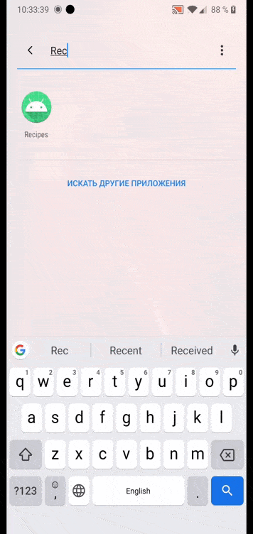
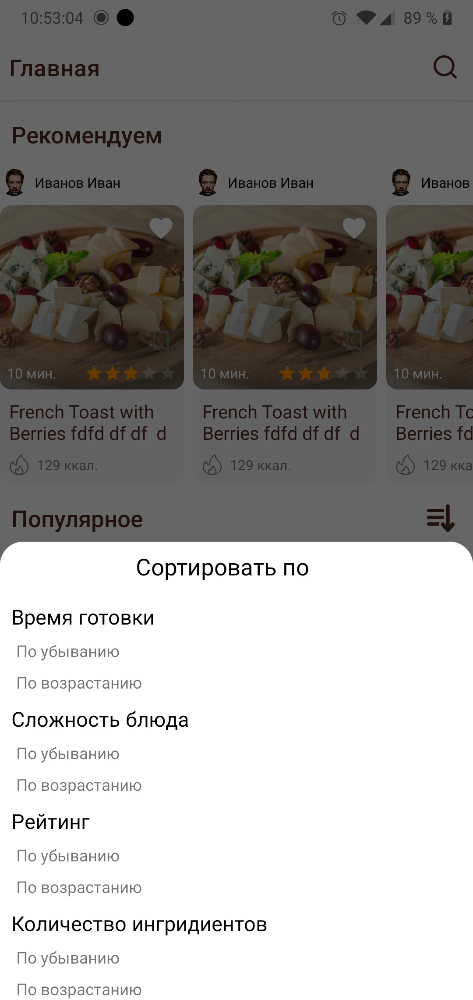
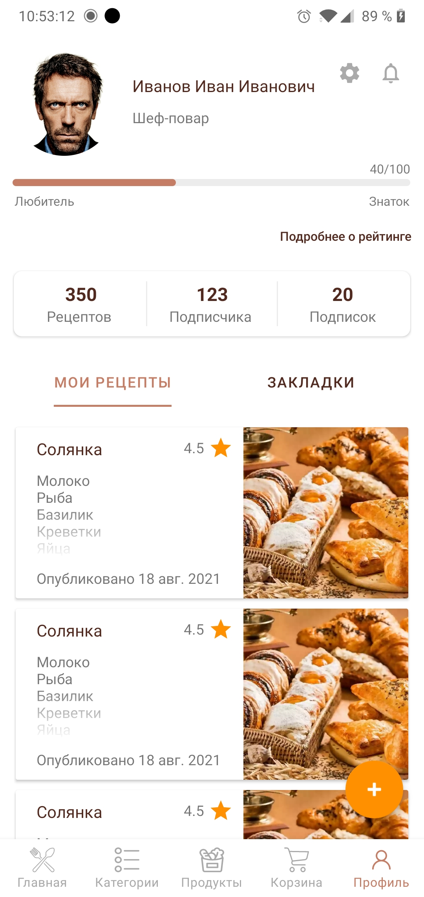
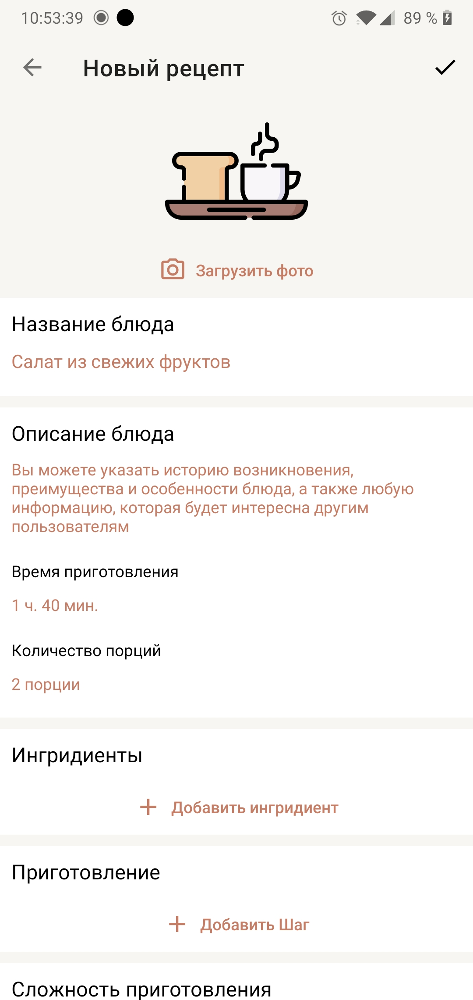

Recipes
===================
> В разработке

Социальная сеть для кулинаров, кулинарная книга.

Работа приложения с помощью:
* Авторизации через Firebase Authentication
* Использования Firestore Database для храннения данных пользователей
* Использования Firebase Storage для храннения изображения блюд и аватарок пользователей
* Использования Room для локального хранения и кэширования данных

Возможности приложения:
* Авторизация с помощью популярных сервисов, а также с помощью логина и пароля
* Поиск, сортировка, комментирование, оценка, добавление блюд
* Подбор блюда по категории и по имеющимся продуктам
* Добавление продуктов в корзину
* Ранг пользователя по активности и оценке их рецептов

### Архитектура
---

* [MVVM](https://developer.android.com/jetpack/guide)
* [Kotlin 100%](https://kotlinlang.org/)
* [Coroutines](https://github.com/Kotlin/kotlinx.coroutines)
* [Flow](https://kotlinlang.org/docs/flow.html)

### Preview
---

### Библиотеки
---

* Service
    * [Firebase-Auth](https://firebase.google.com/)
    * [Firebase-GMS](https://firebase.google.com/)
    * [Firebase-Firestore](https://firebase.google.com/)
    * [Firebase-Storage](https://firebase.google.com/)
* Di
    * [Dagger 2](https://github.com/google/dagger)
* Retrofit2 & OkHttp3
    * [Converter: Gson](https://mvnrepository.com/artifact/com.squareup.retrofit2/converter-gson)
    * [Retrofit](https://mvnrepository.com/artifact/com.squareup.retrofit2/retrofit)
    * [OkHttp Logging Interceptor](https://mvnrepository.com/artifact/com.squareup.okhttp3/logging-interceptor)
* Navigation
    * [Navigation component](https://developer.android.google.cn/guide/navigation/navigation-getting-started?hl=en)
* Other
    * [Glide](https://github.com/bumptech/glide)
    * [Lottie](https://lottiefiles.com/)
    * [Groupie](https://github.com/lisawray/groupie)
    * [CircleImageView](https://github.com/hdodenhof/CircleImageView)
    * [Material Components For Android](https://mvnrepository.com/artifact/com.google.android.material/material)
    * [Core Kotlin Extensions](https://developer.android.com/kotlin/ktx#core)
